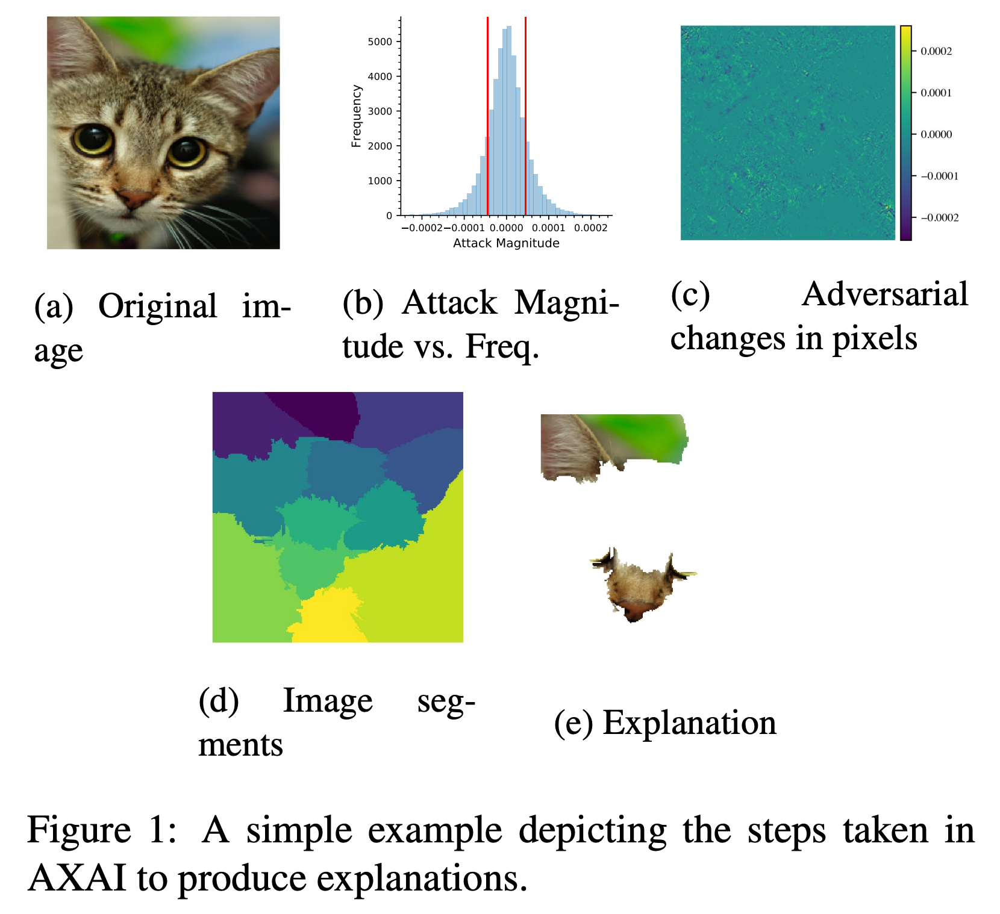

# AXAI, Explaining your DNN via adversarial attack
This repository contains code for the CVPR 2021 paper:

Arash Rahnama, Andrew Tseng. An Adversarial Approach for Explaining the Predictions of Deep Neural Networks. https://openaccess.thecvf.com/content/CVPR2021W/TCV/html/Rahnama_An_Adversarial_Approach_for_Explaining_the_Predictions_of_Deep_Neural_CVPRW_2021_paper.html

Given an input(for example a cat image), AXAI generates local explanations to tell users "why" the model arrive such results(predicting the image as "cat"). For more details, check our paper and run the jupyter notebook demo.




- How to run demo
```bash
conda env create -f AXAI_no_cuda.yml #if using a machine without GPU
or
conda env create -f AXAI_linux.yml #if using a linux machine with GPU
conda activate AXAI
jupyter notebook
```
